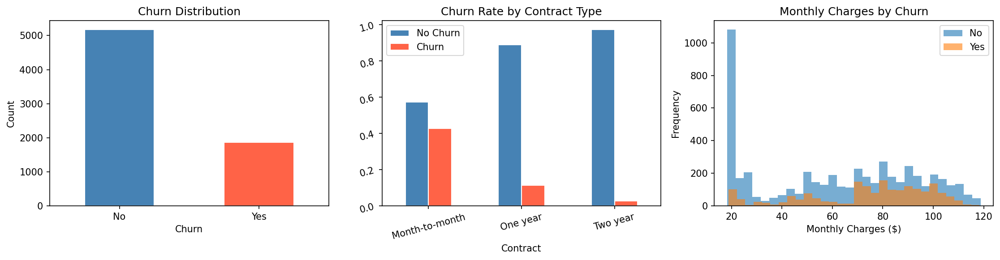
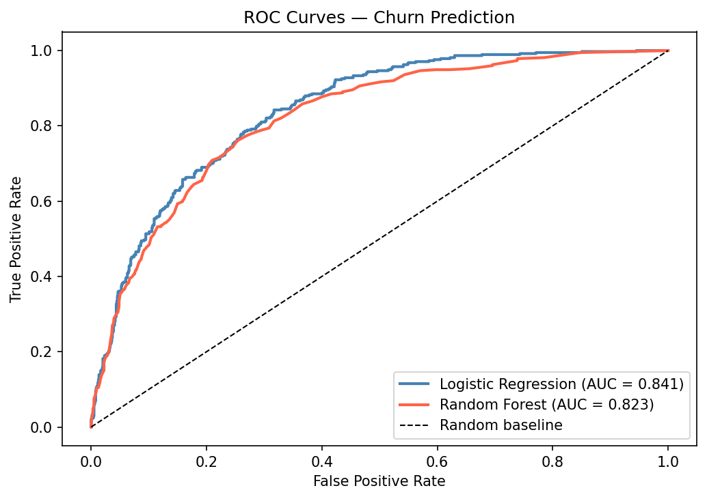
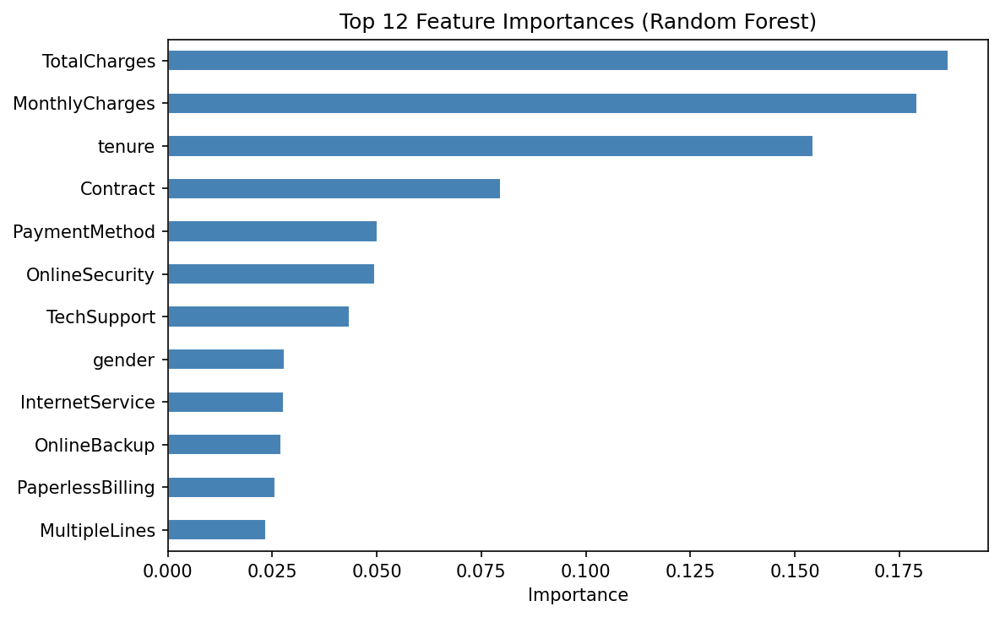

# Customer Churn Prediction

Predicting customer churn using classification models on the Telco Customer Churn dataset.

## Models Used
- Logistic Regression (baseline)
- Random Forest Classifier (tuned with GridSearchCV)

## Results
| Model | ROC-AUC |
|---|---|
| Logistic Regression | 0.XX |
| Random Forest | 0.XX |
| Tuned Random Forest | 0.XX |

## Key Steps
- EDA and feature engineering on 7,000+ customer records
- Label encoding of categorical features
- Hyperparameter tuning with 5-fold GridSearchCV
- Model comparison via ROC curves and confusion matrices

## Plots

## Tech Stack
Python · scikit-learn · pandas · matplotlib · seaborn
